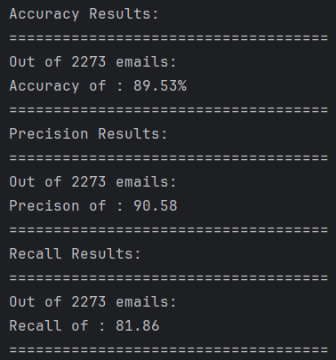
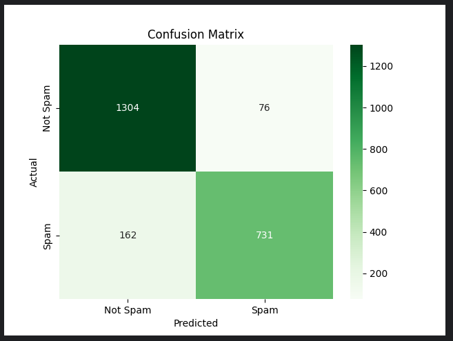

## Naïve Bayes Classification

The process of building a Naïve Bayes classifier was done within the `main()` method of the program attached, using the following method
`buildTrainingTestData()`. this method takes the original dataset of spam and ham emails. Then splits it into `trainingSpambaseData` and `testingSpamBaseData` both of which have a close split consisting of 60% Non-Spam (Ham) and 40% Spam email features and labels.

The Classifier class for this implementation is `emailClassifier`. The classifier has a few constructor methods which pull the _mean_ and _standard deviation_ for each of the training data features for both Hams (Non-Spam) and Spams.

Once the _mean_ and _standard deviations_ are calculated they’re established on the class properties and used for our presumptions with our naïve bayes classification.

The next process is to call the `prepareTestData()` method which takes the target labels and feature vectors and splits them into separate entities for the classification process of the model.

```python
def prepareTestData(testingData):
    # shuffle the test data.
    testingData = testingData.sample(frac=1)

    # split the testing features from the label.
    inputFeatures = np.array(testingData.iloc[:, :-1])

    # pull classifications and for comparison.
    inputTargets = np.array(testingData.iloc[:, -1].to_list())

    return inputFeatures, inputTargets
```

The `emailClassifier` object’s `classifyEmails()` is then called to classify the emails and pull attributes for _true positive_, _true negative_, _false positive_ and _false negative_ all values used to build the confusion matrix after the classification process has been completed. the allows for comparative benchmarks and overall performance metrics.

```python
 def classifyEmails(self, emailFeatures, emailTargets):
        predictedValues = []

        for email in range(len(emailFeatures)):
            self.totalEmailsClassified += 1
            emailFeatureVector = emailFeatures[email]
            targetClass = emailTargets[email]
            # adds a posteriors list
            posteriors = []

            # classify ham
            hamPosterior = np.sum(np.log(self.gaussianNB(emailFeatureVector, self.hamsMean, self.hamsStd)) + np.log(self.trainingHamClassPrior))
            posteriors.append(hamPosterior)

            # classify spam
            spamPosterior = np.sum(np.log(self.gaussianNB(emailFeatureVector, self.spamsMean, self.spamsStd)) + np.log(self.trainingSpamClassPrior))
            posteriors.append(spamPosterior)

            prediction = np.argmax(posteriors, axis=0)

            predictedValues.append(prediction)

            if prediction == targetClass:
                # classify prediction for accuracy metrics:
                # case where the target is classified as spam
                # case where the email is correctly classified as spam
                if prediction == 1 and targetClass == 1:
                    self.truePositives += 1
                # case where classified as not spam and is non-spam
                if prediction == 0 and targetClass == 0:
                    self.trueNegatives += 1
            # case where it wasn't correctly predicted.
            else:
                # case where the email is falsely classified as spam
                if prediction == 1 and targetClass == 0:
                    self.falsePositives += 1
                # case where classified as non spam but is spam email
                if prediction == 0 and targetClass == 1:
                    self.falseNegatives += 1

        self.confusionMatrix = confusion_matrix(emailTargets, predictedValues)
```

The classifier was very accurate when implementing the Gaussian Naïve bayes Algorithm. The resulting accuracies, precision, and recall can be seen below.

### Accuracy Precision Recall



### Confusion Matrix


